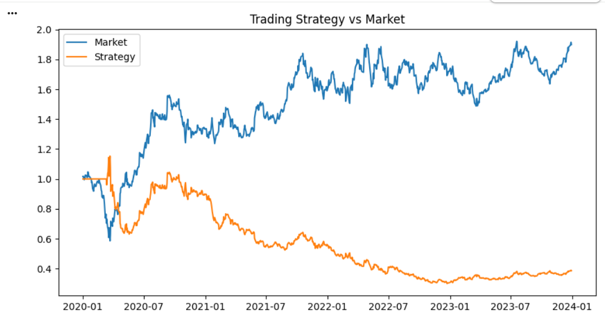

# Algorithmic-Trading-Strategy-using-Moving-Average-Crossover
# 📈 Algorithmic Trading Strategy using Moving Average Crossover

## 📌 Overview
This project implements a rule-based algorithmic trading strategy using moving average crossover. The system generates buy and sell signals based on trend changes and evaluates performance against a buy-and-hold benchmark.

---

## 🎯 Objective
To design and analyze a trading strategy that uses technical indicators to make investment decisions and measure its effectiveness using financial metrics.

---

## 📊 Data Description
- Stock: RELIANCE.NS
- Time Period: 2020–2024
- Data Source: Yahoo Finance
- Data Used: Daily Closing Prices

---

## ⚙️ Strategy Logic
- Short-Term Moving Average (20-day)
- Long-Term Moving Average (50-day)

### Trading Rules:
- BUY when MA20 > MA50
- SELL when MA20 < MA50

---

## 📈 Performance Metrics
- Daily Returns
- Strategy Returns
- Cumulative Returns
- Sharpe Ratio

---

## 📊 Results
- Compared strategy performance with Buy & Hold approach
- Evaluated effectiveness using cumulative returns
- Measured risk-adjusted performance using Sharpe Ratio

---

## 📷 Output

---

## 📁 Project Structure
trading-strategy-system/
│
├── notebooks/
│ └── trading_strategy.ipynb
│
├── src/
│ └── strategy.py
│
├── results/
│ └── performance.png
│
├── README.md
├── requirements.txt

---

## ▶️ How to Run

1. Install dependencies:

2. Run the script:
   
---

## 📊 Analysis & Insights
- The strategy captures trends using moving average crossover
- Helps avoid losses during bearish phases
- Performance depends on market trends
- Compared to buy-and-hold, strategy performance varies based on volatility

---

## ⚠️ Limitations
- Based on historical data assumptions
- Moving averages introduce lag
- Transaction costs not included

---

## 👤 Author
**Niranjan Samantaray**

- 📧 niranjansamantaray03@gmail.com  
- 🔗 LinkedIn: https://www.linkedin.com/in/niranjan-samantaray-3182b4382
